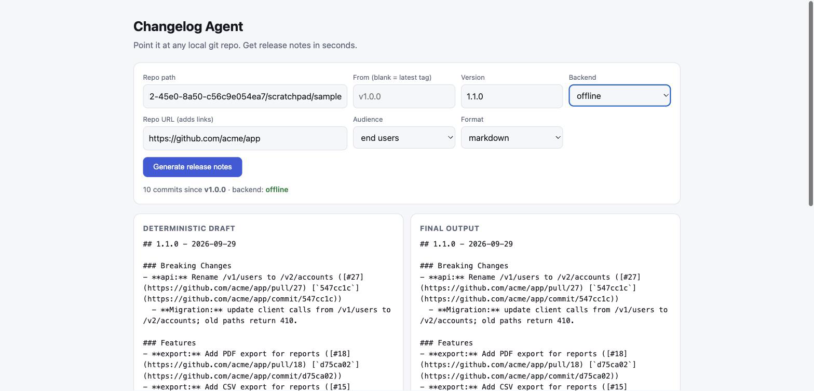

# Changelog Agent

Turn your git history into clean, user-facing release notes in one command.



▶ [Watch the 12-second demo](docs/demo.mp4)

## New to Git? Start here

**What this is:** Git keeps a history of every change ("save point") to your project. This tool reads that history and writes a clean `CHANGELOG.md`: what's new, what got fixed, what might break. Great if you build with ChatGPT, Claude or Cursor and lose track of what changed.

**Pick one way to run it:**

1. **Using Claude Code, Cursor or another AI coding tool?** Open your project and paste:
   > Install github.com/charlie-analytics/changelog-agent with pip and use it to create a CHANGELOG.md for this project.
2. **Using the terminal?** Inside your project folder:
   ```bash
   python3 -m pip install git+https://github.com/charlie-analytics/changelog-agent
   changelog-agent --version 1.0.0 --out CHANGELOG.md
   ```
3. **Prefer clicking?** Run `changelog-agent-ui` and open http://127.0.0.1:8765

**Tip:** ask your AI to start commit messages with `feat:` (new feature) or `fix:` (bug fix). The notes come out much better sorted.

## Features

- **Zero dependencies.** Python 3.9+ standard library only.
- **Works offline.** Reads Conventional Commits, groups them by section, drops `chore`/`ci`/`test`/WIP noise, and flags breaking changes with migration notes.
- **Cleans up like an editor.** Reverted commits cancel out, near-duplicate commits merge (distinct PRs never do), PR and issue references become links, and each release gets a contributors line and a compare link.
- **Optional Claude polish.** Set `ANTHROPIC_API_KEY` and the draft is rewritten for your audience using a senior-editor rubric (benefit-first, active voice, ordered by impact).
- **Guardrails on the LLM.** Output is validated against the draft. Invented hashes or PR numbers, dropped breaking changes or migration notes, or missing changes trigger one retry and then a fallback to the deterministic notes. It never blocks a release.
- **Cached and lazy.** LLM results are cached on disk by input, so the model only runs the first time a given release is seen. Nothing runs until someone asks for notes.
- **Bring any model.** Anthropic API, any OpenAI-compatible endpoint (OpenRouter, vLLM, Ollama, LiteLLM, your own gateway), or the Claude CLI.
- **JSON output** for automation, a **GitHub Action**, and a **local web UI**.

## Quick start

```bash
git clone <this repo> && cd changelog-agent
python3 -m changelog_agent --repo /path/to/your/repo --version 1.2.0
```

Write straight into `CHANGELOG.md` (newest entry on top):

```bash
python3 -m changelog_agent --repo . --from v1.1.0 --version 1.2.0 --out CHANGELOG.md
```

### With Claude (optional)

```bash
export ANTHROPIC_API_KEY=sk-ant-...      # your own key
export CHANGELOG_MODEL=claude-sonnet-5-5 # optional
python3 -m changelog_agent --repo . --version 1.2.0 --print-backend
```

`--backend` accepts `auto` (default), `anthropic`, `openai`, `claude-cli`, or `none`.

Any OpenAI-compatible endpoint:

```bash
export OPENAI_BASE_URL=http://localhost:11434/v1   # e.g. Ollama, vLLM, LiteLLM, OpenRouter
export OPENAI_API_KEY=...                           # optional for local servers
export CHANGELOG_MODEL=llama3.1
python3 -m changelog_agent --repo . --version 1.2.0 --backend openai
```

Results are cached in `~/.cache/changelog-agent` (override with `CHANGELOG_CACHE_DIR`; skip with `--no-cache`).

Tailor it: `--audience developers`, `--tone "punchy"`, `--repo-url https://github.com/org/repo` (adds links), `--format json`.

### GitHub Action

```yaml
- uses: actions/checkout@v4
  with: { fetch-depth: 0 }
- uses: charlie-analytics/changelog-agent@main
  with:
    version: 1.2.0
    anthropic-api-key: ${{ secrets.ANTHROPIC_API_KEY }}  # optional
```

### Live local UI

```bash
python3 -m changelog_agent.server   # http://127.0.0.1:8765
```

## Example (offline mode, real output)

Input: 11 commits since `v1.0.0`.

```
## 1.1.0 - 2026-09-29

### Breaking Changes
- **api:** Rename /v1/users to /v2/accounts (`37e31ea`)

### Features
- **export:** Add PDF export for reports (`a1a4786`)
- **search:** Add fuzzy search across projects (`642bedb`)

### Bug Fixes
- **auth:** Fix login loop when cookies are blocked (`d019492`)
...
```

## Tests

```bash
python3 -m unittest discover -s tests
```

The suite covers commit classification, git-to-markdown end to end, and the LLM path against a local mock server (including failure fallback).

## Roadmap ideas (paid tier)

GitHub Action wrapper, PR-comment mode, monorepo/per-package changelogs, Slack/Discord release announcements, team style guides.

## License

MIT
